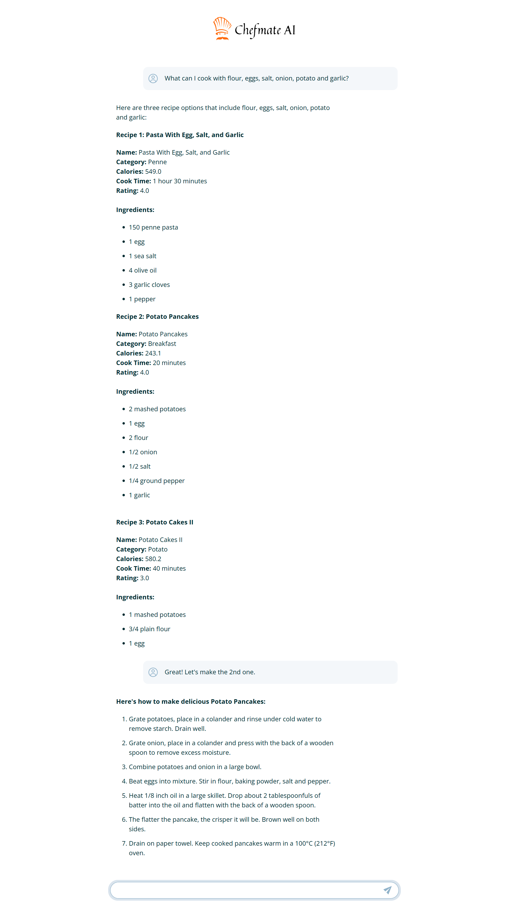

# <h1 align="center">Chefmate AI: Conversational AI Cooking Assistant</h1>

**A full-stack web application that recommends recipes, answers culinary questions, and helps you cook creatively with what's already in your kitchen.**

 


---

## Project Description

**Chefmate AI** is a full-stack AI-driven cooking assistant designed to answer fundamental questions like:

> _“What can I cook with what I have right now?”_

This project reimagines how users interact with recipe databases by transforming traditional keyword searches into a **context-aware, conversational recommendation system**. The frontend features a seamless chat-based user interface that allows users to input their prompts, while the backend executes a highly modular natural language processing (NLP) pipeline powered by local inference and vector-based retrieval (RAG).

Chefmate AI goes beyond static recipes; it understands ingredient substitutions, cooking methods, and dietary constraints through an **LLM-enhanced recipe reasoning engine** enhanced using **Retrieval-Augmented Generation (RAG)**. This enables the system to generate custom cooking instructions and recommendations in real-time, fostering an interactive dialogue that adapts to user needs and preferences.

By combining advanced AI techniques with a user-friendly interface, Chefmate AI provides a dynamic cooking experience that empowers users to explore their culinary creativity and make the most of their available ingredients.

---

## Table of Contents
- [Project Title and Overview](#project-title-and-overview)
- [Project Description](#project-description)
- [Features](#features)
- [Technology Stack](#technology-stack)
- [Project Structure](#project-structure)
- [Documentation](#documentation)
- [Demo](#demo)
- [Installation](#installation)
- [Configuration](#configuration)
- [Testing](#testing)
- [Contribution](#contribution)
- [License](#license)
- [FAQs](#faqs)
- [Contact Information](#contact-information)

---

## Features

### 🧠 Conversational Recipe Retrieval
- Accepts natural-language queries (e.g., _“What can I make with mushrooms and garlic?”_)
- Retrieves relevant recipes using semantic understanding, not keyword matching
- Maintains conversational context over multiple turns

### 🔍 Ingredient-Based Search with Substitution
- Analyzes available ingredients and dietary preferences
- Suggests recipes based on pantry inventory

### 💬 Real-Time Local LLM Inference
- Uses Mistral 7B in GGUF format for local, high-performance inference
- Entire inference stack runs offline — no internet required
- Ensures fast, private, and secure conversational flow

### 📚 Vector-Based Semantic Search
- Embeds both queries and recipes using MiniLM transformers
- Powered by FAISS for high-speed approximate nearest neighbor search
- Smart fallback logic ensures query satisfaction

### 🛠️ Modular NLP Pipeline
- Heuristic intent detection categorizes user messages (e.g., find, refine, clarify)
- Dynamic prompt construction using system template + retrieved context + chat history
- Output is sanitized and structured in standard JSON

### 🧾 Structured Recipe Output
- JSON format includes: title, ingredient list, method, and optional tips
- Cleanly parsed responses ideal for rendering in frontend

### 🧪 Zero External Dependencies
- Fully offline and self-contained
- No external API calls or cloud models
- Perfect for embedded, air-gapped, or privacy-first applications

---

## Technology Stack

### Frontend:

- **HTML5, CSS3, JavaScript** *(if integrated in browser UI)*
- **React.js** *(for rich interactive chat interface, optional template)*
- **Vite** *(for lightning-fast development and bundling)*
- **Tailwind CSS** *(for modern UI styling, optional)*
- **use-immer** *(immutability with minimal boilerplate for `useState`)*
- **Axios API** *(for HTTP communication with backend)*
- **ESLint** *(code linting with React, hooks, and plugin extensions)*

### Backend:

- **Python** *(core backend language)*
- **FastAPI** *(high-performance API framework for routing and inference orchestration)*
- **Uvicorn** *(ASGI server for high-speed FastAPI hosting)*
- **FAISS** *(Facebook AI Similarity Search for efficient vector retrieval)*
- **Sentence Transformers**: `all-MiniLM-L6-v2` *(for embedding user queries and recipe corpus)*
- **Prompt Construction Engine** *(Jinja2 templating or dynamic string formatting for building LLM prompts)*
- **Custom Heuristic Engine** *(for intent detection from user message)*

### LLM & Inference Engine:

- **Mistral 7B (GGUF)** – Lightweight yet powerful open-weight model used for chat response generation.
- **llama.cpp** – Backend inference engine for running the quantized Mistral model locally on CPU/GPU.
- **GGUF Format Loader** – Efficient model loading and quantized inference using compatible runtimes.
- **Prompt Construction Pipeline** – System, context, and history combined to create efficient input for LLM.

### NLP & Processing Pipeline:

- **Heuristic-based Intent Detection** *(determine user goal: search, refine, clarify, etc.)*
- **Embedding Pipeline using Sentence Transformers** *(MiniLM)*
- **Semantic Retrieval using FAISS** *(fallback logic on score thresholds)*
- **Post-processing module** *(cleans and formats LLM output into structured JSON)*

### Tools & Environment:

- **Git & GitHub** *(version control and collaboration)*

---

## Project Structure

### Backend (`/backend`)

- **main.py**: FastAPI entrypoint, CORS setup, router registration.
- **requirements.txt**: All Python dependencies.
- **app/**
  - **api/**: FastAPI routers for chat and data preparation.
  - **core/**: Startup logic, dependency initialization.
  - **utils/**: Core logic for embeddings, FAISS, LLM, intent detection, prompt engineering, and recipe preprocessing.

### Frontend (`/frontend`)

- **src/**
  - **App.jsx**: Main React component.
  - **components/**: Chatbot UI, chat messages, input, spinner, etc.
  - **hooks/**: Custom React hooks (auto-scroll, autosize).
  - **api.js**: Handles API calls and streaming.
  - **utils.js**: SSE stream parsing.
  - **assets/images/**: Logo and icons.
- **tailwind.config.js**: Tailwind CSS configuration.
- **vite.config.js**: Vite build and alias configuration.
- **package.json**: JS dependencies and scripts.
- **.env**: API URL configuration.

---

## Documentation

This project includes detailed backend architecture and API documentation for the Chefmate AI system.

### 🔧 Backend API and Flow

- [**Backend API Documentation**](./docs/backend_api_doc.pdf)  
  Comprehensive reference for the `/chat` endpoint and RAG + LLM response pipeline.

- [**RAG Flow Diagram**](./docs/rag_llm_backend_flow.png)  
  *High-level flowchart of the backend request pipeline (RAG + LLM).*

- [**Backend Flow Diagram**](./docs/backend_api_flow_diagram.png)  
  Visual walkthrough of the backend logic per user request.

### 🧠 System Architecture

- [**Chefmate System Architecture (PNG)**](./docs/chefmate_system_architechture.png)  
  End-to-end system layout including frontend, backend, database, and LLM components.

- [**Chefmate Pipeline Architecture (Text)**](./docs/chefmate_pipeline_architechture_diagram.txt)  
  Textual breakdown of the processing pipeline logic for easy version tracking and discussion.

---

## Demo

Below are snapshot of the application showcasing its functionality:



---

## Installation

Chefmate AI consists of a Python backend (FastAPI) and a React frontend. Follow these steps to set up both locally.

### Prerequisites

- **Node.js** (v18+ recommended)
- **npm** (v9+ recommended)
- **Python** (3.10+)
- **pip** (latest)
- **Git** (Optional) 
- **virtualenv** (for Python isolation)

--

### 1. Clone the Repository

```bash
git clone https://github.com/ThakkarVidhi/chefmate-ai.git
cd chefmate-ai
```

--

### 2. Backend Setup

#### a. Create and Activate a Virtual Environment (Recommended)

```bash
cd backend
python -m venv .venv

# On Windows:
.venv\Scripts\activate

# On macOS/Linux:
source .venv/bin/activate
```

#### b. Install Python Dependencies

```bash
pip install --upgrade pip
pip install -r requirements.txt
```

#### c. Download and Set Up the LLM (GGUF Model)

- Go to the Hugging Face page:
[Mistral-7B-Instruct-v0.2-GGUF](https://huggingface.co/TheBloke/Mistral-7B-Instruct-v0.2-GGUF)

- Download this specific file:
    ```bash
    mistral-7b-instruct-v0.2.Q5_K_M.gguf
    ```
(Q5_K_M is recommended: low quality loss, 5.13 GB)

- Save the file to:
    ```bash
    backend/models/mistral-7b-instruct-v0.2.Q5_K_M.gguf
    ```

#### d. Configure Environment

- Edit `config.yml` (in the backend root) to set paths for:
  - Model file (GGUF)
  - Recipe data
  - FAISS index directory
  - Cleaned data files

#### e. Prepare Recipe Data and Indexes

- Ensure your raw recipe CSV is available at the path specified in your config (see `config.yml`).
- Run the data preparation endpoint to clean, embed, and index recipes:

```bash
# Start the backend server (in one terminal)
uvicorn main:app --reload

# In another terminal, POST to the data preparation endpoint:
curl -X POST http://localhost:8000/data/initialize-recipes
```

- Download the raw recipe dataset from Kaggle: [Kaggle Food Recipes Dataset](https://www.kaggle.com/datasets/irkaal/foodcom-recipes-and-reviews/data?select=recipes.csv)

- Save the raw CSV in:
    ```bash
    backend/data/raw/recipes.csv
    ```

- Preprocessed data and embeddings are stored in:
    ```bash
    backend/data/processed/
    ```

- FAISS indexes for: Titles, Ingredients & Ingredients + Quantities are located in:
    ```bash
    backend/data/indexes/
    ```

#### f. Run the Backend Server
    
```bash
uvicorn main:app --reload
```

- The API will be available at [http://localhost:8000](http://localhost:8000).

--

### 3. Frontend Setup

```bash
cd ../frontend
npm install
```

#### a. Configure Environment Variables

- Create a `.env` file in `frontend/` with the following (adjust as needed):

```
VITE_API_URL=http://localhost:8000
```

#### b. Start the Frontend Development Server

```bash
npm run dev
```

- The app will be available at [http://localhost:3000](http://localhost:3000).

--

### 4. Access the Application

- Open [http://localhost:3000](http://localhost:3000) in your browser.
- Chat with the AI, enter ingredients, and get recipe suggestions!

---

## Configuration

Follow the instructions below to set up the configuration files.:

### Backend

Located at: `backend/config.yml`

This file defines the paths to your data, model, and index files, as well as the settings for embedding generation.

```yaml
paths:
  recipe_data: "data/raw/recipes.csv"                     # Raw recipe dataset from Kaggle
  cleaned_data_csv: "data/processed/cleaned_recipes.csv"  # Cleaned CSV after preprocessing
  cleaned_data_pkl: "data/processed/cleaned_recipes.pkl"  # Serialized data for fast loading
  faiss_index_dir: "data/indexes"                         # Directory containing FAISS indexes
  model_path: "models/mistral-7b-instruct-v0.2.Q5_K_M.gguf"  # Path to the downloaded GGUF model

embedding:
  model_name: "all-MiniLM-L6-v2"    # Sentence-transformers model used for recipe embeddings
  batch_size: 128                   # Batch size for embedding generation
```

### Frontend

Located at: `frontend/.env`

This file contains the base API URL used by the React frontend to communicate with the FastAPI backend.

```env
VITE_API_URL='http://localhost:8000'
```

---

## Testing

To ensure Chefmate AI is working correctly, follow these steps for basic backend and frontend validation.

### Backend Testing

- Start the backend server:
    ```bash
    uvicorn main:app --reload
    ```

- Try endpoint: `/chat`

- Test a basic ingredients POST request:
    ```bash
    curl -X POST http://localhost:8000/chat/ -H "Content-Type: application/json" --data-raw '{"chat_history":[{"role":"user","content":"What can I cook with flour, eggs, salt, onion and garlic"}]}'
    ```

### Frontend Testing

- Start the frontend development server:
    ```bash
    npm run dev
    ```

- Access the app at:
    ```bash 
    http://localhost:3000
    ```

- Enter a few ingredients or recipe suggestions.

- Check the browser console and network tab for API activity.

- Verify error messages and UI responsiveness.


> Full automated tests will be added in future version.

---

## Contribution

1. Fork the repo

2. Create a new branch (`git checkout -b feature/your-feature`)

3. Make changes & commit (`git commit -m 'Add a feature'`)

4. Push to the branch (`git push origin feature/your-feature`)

5. Open a Pull Request


---

## License

This project is licensed under the [MIT License](LICENSE).  


---

## FAQs

**Q: Where can I get the recipe dataset?**  
**A:** The dataset is sourced from Kaggle. Search for "Food Recipes Dataset" on Kaggle, download the CSV file, and place it at the path defined in `config.yml`, usually `data/raw/recipes.csv`.

--

**Q: The backend is not starting because of a missing model file. What should I do?**  
**A:** You must manually download the mistral-7b-instruct-v0.2.Q5_K_M.gguf model file from Hugging Face:
[https://huggingface.co/TheBloke/Mistral-7B-Instruct-v0.2-GGUF](https://huggingface.co/TheBloke/Mistral-7B-Instruct-v0.2-GGUF)

Save the file to the `backend/models/` directory. Make sure the path in your `config.yml` is correctly set to point to this file.

--

**Q: The frontend loads, but nothing is displayed. What’s wrong?**  
**A:** Check the following:

- Make sure the backend is running at `http://localhost:8000`

- Verify that the `.env` file in the frontend directory includes the correct API URL (e.g., VITE_API_URL='http://localhost:8000')

- Ensure the recipe data has been properly cleaned and indexed. Files should exist in `data/processed/` and `data/indexes/`.

--

**Q:How is recipe data processed and indexed?**  
**A:** 
- Raw recipe data is cleaned and stored in `data/processed/`.

- Embeddings are generated and stored in the same folder.

- FAISS indexes for title, ingredient, and ingredient_with_quantity are saved in `data/indexes/`.

You can update the configuration paths for these in `config.yml`.

Refer to the Installation and Configuration sections above for detailed setup.

---

## Contact Information

For questions or feedback, feel free to reach out:

- **Email**: [vidhithakkar.ca@gmail.com](mailto:vidhithakkar.ca@gmail.com)
- **LinkedIn**: [Vidhi Thakkar](https://www.linkedin.com/in/vidhi-thakkar-0b509724a/)
